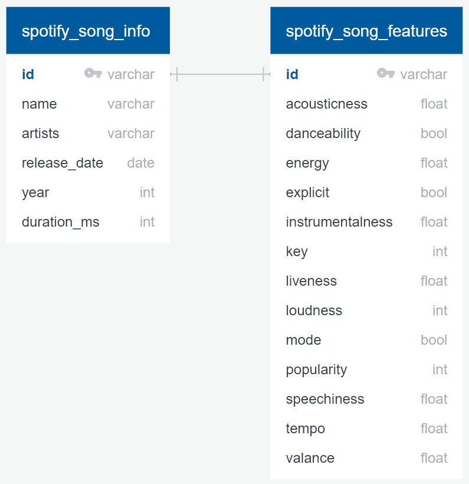

# Danceability-of-Spotify-Songs

## Team Members:
* Faith: Github Repository
* Daniel: Machine Learning Model
* Diana: Database Integration

## Communication Protocols: 
* Slack for quick and easy communication among team members
* Zoom meetings on Tuesday, Thursdays and Saturdays
* Additional meetings on other days if necessary

## Project Overview

### Topic: Danceability of Spotify Songs from 1921 to 2020

### Softwares Used
* Jupyter Notebook
* ERD (Entity Relationship Diagram) Tool
* pgAdmin
* Tableau Public
* Languages (Python, SQL)
* Dependencies (sqlalchemy, Pandas, TensorFlow, Scikit-learn)

### Reasons for Selected Topic

- **Mutual Interest** - Music is a popular topic and a common interest amongst the team. Although we like different genres we all listen to music on a daily basis and has become an important factor in our lives
- **Growing Industry** - The music industry is continuously growing and nhas become more accessible than ever with multiple streaming options. Spotify recorded 188 million Spotify premium subscribers in the second quarter of 2022 and has 60,000 songs being uploaded every day
- **Interested in Learning** - How the danceability of songs have changed over time and if a machine learning can predict the danceability of a song based on different factors

### Description of Dataset Source
* Dataset was downloaded from [Kaggle](https://www.kaggle.com/datasets/ektanegi/spotifydata-19212020) and captured the top 2000 songs on Spotify for each year from 1921 to 2020
* Columns include general song information and [song features](https://developer.spotify.com/documentation/web-api/reference/#/operations/get-audio-features) which contain audio feature information for each unique Spotify Id
* Data was collected from Spotify Web API 
* Dimension of Original Dataset: 169,909 rows by 19 columns

### Questions we hope to answer
* Can machine learning models predict the danceability of Spotify songs using audio feature information?
* How has danceability changed throughout the years from 1921 to 2020?
* How danceable or energetic a song is?
* How various factors can predict the danceability of a song.

## Machine Learning Model

### Purpose
A machine learning model was created to make predictions on the danceability of spotify songs. The target, danceability, was converted into a classification problem during the database preprocessing phase. Therefore, a classification machine learning model will examine the features as the input (X) and attempt to predict the danceability as the output (y). The machine learning model code can be found here: *[machine_learning_models.ipynb](Machine_Learning_Model/machine_learning_models.ipynb)*. 

### Data Preprocessing
For the data preprocessing phase, we:
* determined the shape of the dataset
* verified the datatypes for each column
* checked for null values and duplicate values
* moved all non-numerical values to a second dataframe and kept all numerical values on the main dataframe

### Feature Engineering
The following tasks were completed during the feature engineering phase: 
* encoded the *key* column with Scikit-learn's OneHotEncoder()
* scaled the *year*, *duration_ms*, *loudness*, and *tempo* columns with Scikit-learn's StandardScaler()

### Feature Selection
The following columns from the *[merged_spotify_songs.csv](Resources/merged_spotify_songs.csv)* dataset were selected to be features for the machine learning model:

| Feature | Description |
| :------ | :---------- |
| year | the year the track was released |
| duration_ms | the length of the track in milliseconds |
| acousticness | confidence measure of whether the track is acoustic |
| danceability (target) | whether the track is suitable for dancing |
| energy | perceptual measure of intensity and activity |
| explicit | whether the track contains explicit language | 
| instrumentalness | predicts whether a track contains no vocals |
| key | key the track is in (i.e 0 = C, 1 = C#/D♭, 2 = D, 3 = D#/E♭, ... , 11 = B) |
| liveness | detects presence of audience |
| loudness | loudness of track in decibels (dB) |
| mode | modality of a track (1 = major,  0 = minor) |
| popularity | calculated by total number of plays and how recent plays are |
| speechiness | detects presence of spoken words |
| tempo | tempo of track in beats per minute (BPM) | 
| valence | describes the musical positiveness conveyed by a track | 

All the above audio features were selected because of their numerical values and strong probability for predicting danceability. Definitions for the above audio features were sourced from the *[Spotify Audio Feature Reference](https://developer.spotify.com/documentation/web-api/reference/#/operations/get-audio-features)*.

### How Data was Split into Training and Testing
In our machine learning model, we chose to split the data into 75% training and 25% testing. 

### Machine Learning Models - Choice, Benefits, and Limitations
The following supervised, classification machine learning models were incorporated in *[machine_learning_models.ipynb](Machine_Learning_Model/machine_learning_models.ipynb)*:

1. Logistic Regression
2. Decision Tree
3. **Balanced Random Forest Classifier**
4. Easy Ensemble AdaBoost Classifier
5. Deep Neural Network

From the multiple machine learning models that we selected, the Balanced Random Forest Classifier had the highest accuracy of 82.37%. Thus, the model we focused on was the Balanced Random Forest Classifier. The benefits and limitations of this model are summarized below: 

| Benefits | Limitations |
| :------- | :---------- |
| Runs very quickly compared to the Easy Ensemble AdaBoost Classifier and the Deep Neural Network | Uses more computational power and resources as the output is combining hundreds of trees |
| Is robust against overfitting and outliers | Requires more time to train as compared to a simple Decision Tree model |

### Changes to the Machine Learning Model
To improve the accuracy of the machine learning model, the following changes were made to the original algorithm:
* kept the *date* and *duration_ms* columns which were originally dropped when creating the feature dataframe
* used StandardScaler() to scale the data instead of manually scaling the *loudness* and *tempo* columns
* increased the number of trees (*n_estimators*) for the model from 100 to 500
* the accuracy of the Balanced Random Forest Classifier model increased by approximately 1.50%

### Steps: Balanced Random Forest Classifier
The following steps summarize how we created the machine learning model (*[random_forest_classifier.ipynb](Machine_Learning_Model/random_forest_classifier.ipynb)*): 

1. Dropped unnecessary, non-numerical columns
2. Encoded the *key* column with OneHotEncoder()
3. Split the data into input (X) and output (y) with danceability as the target feature
4. Split the Data into training and testing: 75%/25%
5. Scaled the input (X) data with StandardScaler()
6. Defined a model: model = BalancedRandomForestClassifier()
7. Trained the model: model.fit(X_train_scaled, y_train)
8. Made predictions: y_pred = model.predict(X_test)
9. Validated the model: confusion_matrix(), balanced_accuracy_score(), and classification_report()

### Results: Balanced Random Forest Classifier
The accuracy scores and classification report for our sample Random Forest Classifier model are shown below:
* model had an accuracy of 82.37% for predicting danceability
* achieved a precision of 0.88 and a recall of 0.82 for predicting danceability
* achieved an f1-score of 0.85 for predicting danceability

### Conclusion: Balanced Random Forest Classifier
To conclude, this machine learning model addresses our machine learning questions and can predict the danceability of Spotify songs with an accuracy of 82.37%. During the machine learning optimzation phase, it was essential to keep the previously dropped numerical columns (*year* and *duration_ms*) and to scale the data with StandardScaler. Changing the number of trees in the forest model from 100 to 500 also improved its accuracy. 

## Database

We plan to use a SQL database (PostgreSQL and pgAdmin) to store our data. 

Our dataset consists of two tables: 
- *[spotify_song_info.csv](Resources/spotify_song_info.csv)* which contains general information about each song 
- *[spotify_song_features.csv](Resources/spotify_song_features.csv)* which contains feature columns and the target column *danceability* that we plan to use for our machine learning model. 

Using pgAdmin two tables were created to store both datasets (*[query](Database/query.sql)*) and joined them to create our third table in order to store the *[merged_spotify_songs.csv](Resources/merged_spotify_songs.csv)*. 

Using Python Pandas Library in *[final_preprocessing_data .ipynb](Database/final_preprocessing_data.ipynb)*, the two tables were merged into one dataset, which was examined, cleaned, and sent to a PostgreSQL database via a connection string using SQLAlchemy into the merged_spotify_songs table previously created.

The Entity Relationship Diagram for the two tables is shown below:  

## Dashboard
We plan to use Tableau Public to create the final dashboard for the project. Few reasons why Tableau will be used are:
* It is easy to use;
* It can easily handle large data;
* It is an effective tool used to quickly create data visualizations;
* It offers real-time analysis;
* It can transform data into an engaging story that can be easily understood by the audience.

The final dashboard will show the number of songs, how danceability has changed throughout the years and show some factors that affects it. 

## Tableau Public
The story contains the following information:
#### Number of songs in the dataset: 
According to the picture below, there are 169,909 songs in the spotify dataset.

#### Danceablity over the years: 
The line chart below shows that danceability has increased throughout the years (from 1921-2020)
* the x-axis represents the Year field;
* the y-axis represents the Danceability field; 
* The darker the green color, the higher the danceability.

#### Factors affecting danceability: 
The line chart below shows that Energy has an effect on Danceability
* x-axis represents the Year field;
* y-axis represents the Danceability field;
* The legend shows that the green line represents Danceability and 
* the gold line represents Energy throughout the years. 
* The higher the Energy, the higher the danceability of the song. 

## Links

### Link to Tableau Story
[Tableau Story](https://public.tableau.com/app/profile/faith.emenike/viz/SpotifyChangeinDanceabilityDashboardOverview/Story3?publish=yes)

### Link to Google Slides Presentation
[Presentation](https://docs.google.com/presentation/d/1SLyJo5VTJr1ISsJsDj2ul_97DUWQovaDkD5HBMjirlo/edit?usp=sharing)

