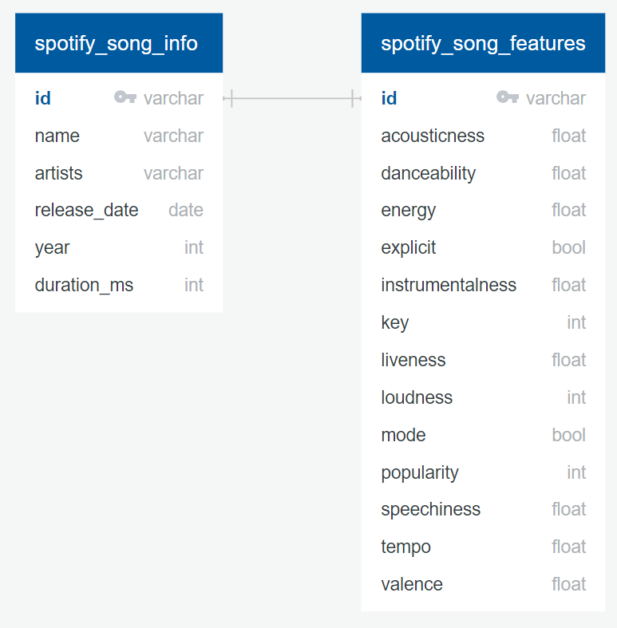

# Danceability-for-Spotify-Songs

## Team Members
* **Square**: Faith
* **Triangle**: Diana
* **Circle**: Daniel

## Communication Protocols: 
* Slack for messaging 
* Zoom meeting on Tuesday, Thursdays and Saturdays
* Flexible to meet other days if necessary

## Project Overview

### Topic
Danceability for Spotify Songs from 1921 to 2020

### Reasons for Selected Topic
* How machine learning can predict the danceability of a song using different factors.
* How machine learning can predict the danceability of a song

### Description of Dataset Source
* Dataset from Kaggle which was collected from Spotify Web API 
* Number of columns and rows: 169909 rows X 19 columns

### Questions we hope to answer
* How the danceability has changed throughout the years from 1921 to 2020
* How danceable or energetic a song is?
* How various factors can predict the danceability of a song.

## Machine Learning Model

## Database Integration
We plan to use a SQL database (PostgreSQL and pgAdmin) to store our data. Our dataset consists of two tables: *[spotify_song_info.csv](Resources/spotify_song_info.csv)* which contains general information about each song and *[spotify_song_features.csv](Resources/spotify_song_features.csv)* which contains feature columns that we plan to use in our machine learning model. *spotify_song_features.csv* also contains the target column, *Danceability*, for our machine learning model. The two tables will be merged into one dataset (*merged_spotify_songs.csv*) using SQL and be cleaned using the Python Pandas library. The Entity Relationship Diagram for the two tables is shown below:  

